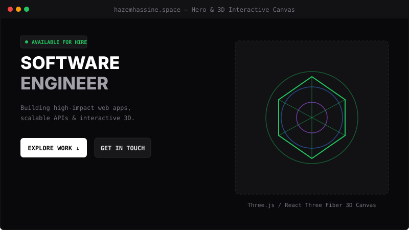
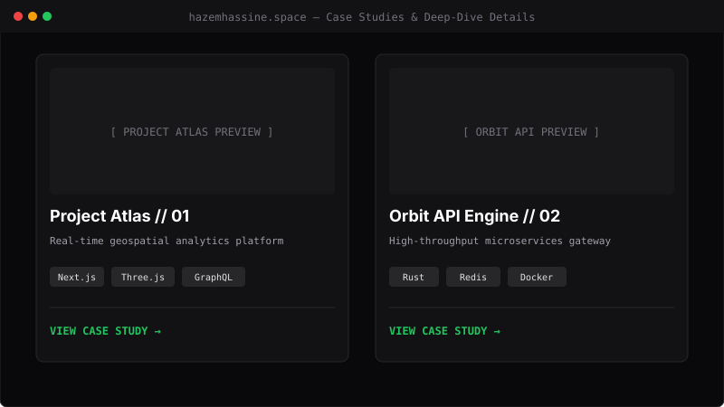
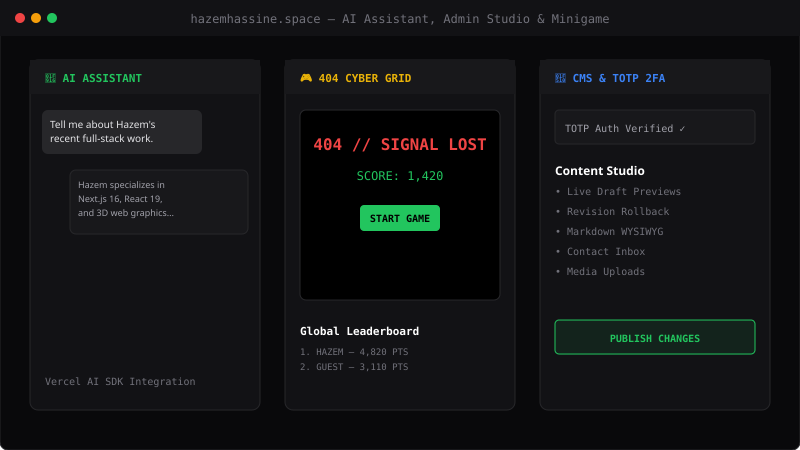

<div align="center">


# Developer Portfolio Template

**A high-performance, brutalist developer portfolio with interactive 3D graphics, an AI portfolio assistant, responsive project case studies, a Markdown blog, an interactive 404 minigame, and an optional Supabase CMS with TOTP 2FA admin studio.**

[](https://developer-portfolio-template.hazemhassine.space/)
[](https://nextjs.org/)
[](https://react.dev/)
[](https://tailwindcss.com/)
[](https://threejs.org/)
[](https://supabase.com/)
[](LICENSE)

[🌐 View Live Demo](https://developer-portfolio-template.hazemhassine.space/) • [🚀 Quick Start](#-quick-start) • [✨ Features](#-features) • [⚙️ Customization](#-customization-guide) • [🔐 Admin CMS](#-optional-supabase-cms--admin-studio)

</div>

---

## 📸 Showcase & Visuals

### 🖥️ Hero & Interactive 3D WebGL Canvas
Dynamic mouse-reactive 3D wireframe geometries built with Three.js & React Three Fiber, complemented by a cyber-brutalist header, terminal status badge, and smooth framer-motion entry animations.

<div align="center">
  
</div>

---

### 📁 Responsive Project Case Studies
Detailed case studies featuring architecture diagrams, problem statements, measurable impact metrics, live links, and technical stack badges.

<div align="center">
  
</div>

---

### 🤖 AI Assistant • 🎮 404 Cyber Game • 🔐 Admin Studio
- **Grounded AI Assistant:** Floating chat assistant powered by Vercel AI SDK, with a dynamic system prompt grounded in your actual skills, experience, and projects.
- **404 Retro Minigame:** Interactive cyber grid obstacle game with keyboard/touch controls, audio feedback, and a global Supabase leaderboard.
- **2FA-Protected Admin CMS:** Browser-based content management studio with TOTP multi-factor authentication, live draft previews, version rollback, and an inbox manager.

<div align="center">
  
</div>

---

## ✨ Features

- **🎨 Modern Cyber-Brutalist Aesthetic:** Dark mode palette, custom reactive cursor, noise texture overlay, monospaced typography, and high-contrast accents.
- **🌐 Three.js / WebGL Integration:** Interactive 3D hero scene with customizable meshes, materials, and physics-driven cursor response.
- **🤖 Built-in AI Portfolio Assistant:** Context-aware assistant powered by Vercel AI SDK (`ai` & `@ai-sdk/react`) that answers visitor questions about your work.
- **📝 Markdown & MDX Blog:** Fast, static Markdown blog engine with YAML frontmatter, reading time estimation, syntax highlighting, and category tags.
- **🎮 Interactive 404 Minigame:** Fully playable grid-runner minigame with high-score tracking and global leaderboard integration.
- **🔐 Headless Supabase CMS:** Optional full-stack content management with draft previews, revision history, media asset manager, and contact inbox.
- **🛡️ TOTP 2FA Admin Authentication:** Zero third-party auth dependency; secure TOTP RFC 6238 authenticator app flow with signed JWT cookies.
- **📬 Spam-Protected Contact Form:** Contact form with honeypot validation, rate limiting, and optional email delivery via Resend.
- **⚡ SEO & Performance Optimized:** Dynamic `sitemap.xml`, `robots.txt`, OpenGraph & Twitter cards metadata generation, and Vercel Analytics.
- **🐳 Multi-Stage Docker & Compose:** Ready for containerized deployment with standalone Next.js server output.

---

## 🛠️ Tech Stack

| Layer | Technology |
|---|---|
| **Framework** | [Next.js 16](https://nextjs.org/) (App Router, Turbopack, Server Components) |
| **UI & Styling** | [React 19](https://react.dev/), [Tailwind CSS v4](https://tailwindcss.com/) |
| **Animations** | [Framer Motion](https://www.framer.com/motion/) |
| **3D Graphics** | [Three.js](https://threejs.org/), [React Three Fiber](https://r3f.docs.pmnd.rs/), [@react-three/drei](https://github.com/pmndrs/drei) |
| **AI Integration** | [Vercel AI SDK](https://sdk.vercel.ai/docs), Vercel AI Gateway |
| **Database & CMS** | [Supabase](https://supabase.com/) (PostgreSQL, Row Level Security, RPCs) |
| **Auth & Security** | TOTP 2FA (RFC 6238), [Jose](https://github.com/panva/jose) (JWT) |
| **Email Delivery** | [Resend](https://resend.com/) |
| **Markdown** | [React Markdown](https://github.com/remarkjs/react-markdown), Gray-Matter, UIW Markdown Editor |
| **DevOps** | Docker multi-stage build, GitHub Actions, Vercel |

---

## 🚀 Quick Start

### Prerequisites
- **Node.js 22+**
- **npm** (or `pnpm` / `yarn`)

### 1. Clone the repository
```bash
git clone https://github.com/HazemHassine/developer-portfolio-template.git
cd developer-portfolio-template
```

### 2. Install dependencies
```bash
npm install
```

### 3. Setup environment variables
```bash
cp .env.example .env.local
```

### 4. Run the development server
```bash
npm run dev
```

Open [http://127.0.0.1:3000](http://127.0.0.1:3000) in your browser. The core portfolio, 3D elements, and local Markdown blog work out-of-the-box without configuring any external services.

---

## ⚙️ Customization Guide

Personalize the template by editing these core files:

| Target | File | Description |
|---|---|---|
| **Identity & Socials** | [`lib/data.js`](lib/data.js) | Name, titles, bio, social URLs, timeline, and education. |
| **Project Case Studies** | [`lib/projects-data.js`](lib/projects-data.js) | Deep-dive case studies, architecture notes, metrics, and links. |
| **Skills & Tooling** | [`lib/skillsData.js`](lib/skillsData.js) | Detailed technical stack categories, proficiencies, and proof points. |
| **SEO & Copy** | [`lib/cms-shared.js`](lib/cms-shared.js) | Meta titles, descriptions, banner marquee text, and color tokens. |
| **Blog Articles** | [`content/blog/*.md`](content/blog/) | Static Markdown articles with frontmatter metadata. |
| **Profile Photo** | [`public/profile-placeholder.svg`](public/profile-placeholder.svg) | Avatar image used in the hero and about sections. |
| **Project Media** | [`public/projects/`](public/projects/) | Screenshot assets referenced in project case studies. |
| **Favicon & Icon** | [`app/icon.svg`](app/icon.svg) | Browser tab icon. |

---

## 🔐 Optional Supabase CMS & Admin Studio

The template defaults to the local static files in the repository. To enable browser-based content editing:

1. Create a project at [supabase.com](https://supabase.com).
2. Go to the **SQL Editor** in Supabase and execute [`supabase/cms.sql`](supabase/cms.sql).
3. Copy your project credentials into `.env.local`:
   ```env
   NEXT_PUBLIC_SUPABASE_URL=https://your-project.supabase.co
   NEXT_PUBLIC_SUPABASE_ANON_KEY=your-anon-key
   SUPABASE_SERVICE_ROLE_KEY=your-service-role-key
   ```
4. Generate a base32 TOTP secret for 2FA authentication (e.g. using `speakeasy` or an online base32 generator) and add it to `.env.local`:
   ```env
   ADMIN_TOTP_SECRET=JBSWY3DPEHPK3PXP
   JWT_SECRET=your-secure-random-jwt-secret-string-at-least-32-chars
   ```
5. Scan or enter the `ADMIN_TOTP_SECRET` into Google Authenticator, 1Password, or Authy.
6. Visit `/admin` and log in with your 6-digit TOTP code.

---

## 🔑 Environment Variables Reference

| Variable | Required | Description |
|---|---|---|
| `NEXT_PUBLIC_SITE_URL` | Recommended | Canonical base URL (e.g. `https://developer-portfolio-template.hazemhassine.space`) |
| `NEXT_PUBLIC_SUPABASE_URL` | Optional | Supabase project URL for CMS, media & leaderboard |
| `NEXT_PUBLIC_SUPABASE_ANON_KEY` | Optional | Supabase client anonymous API key |
| `SUPABASE_SERVICE_ROLE_KEY` | Optional | Supabase service role secret key (server-side only) |
| `ADMIN_TOTP_SECRET` | Optional | Base32 TOTP secret for `/admin` 2FA login |
| `JWT_SECRET` | Optional | Encryption secret for admin session tokens |
| `AI_GATEWAY_API_KEY` | Optional | Vercel AI Gateway API key for portfolio chat assistant |
| `RESEND_API_KEY` | Optional | API key from Resend for contact form email routing |

---

## 🐳 Docker Deployment

Run the complete portfolio in a containerized standalone environment:

```bash
# Build and run with Docker Compose
docker compose up --build -d

# Verify logs
docker compose logs -f
```

The container exposes port `3000` and includes built-in health check polling.

---

## 📦 Scripts

```bash
npm run dev      # Start development server on 127.0.0.1:3000
npm run build    # Build optimized production bundle
npm run start    # Start production server
npm run lint     # Run ESLint checks
```

---

## 📄 License

Distributed under the **MIT License**. See [`LICENSE`](LICENSE) for more information.

---

<div align="center">
  <sub>Built with Next.js 16, React 19, Three.js & Tailwind CSS 4. Crafted by <a href="https://hazemhassine.space">Hazem Hassine</a>.</sub>
</div>
